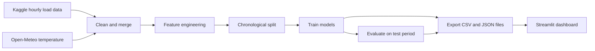

# Electricity Load Forecasting with Time Series ML

[](https://energyconsumptionforecasting-3abkbqypyaj6zna7ltvq5s.streamlit.app/)


Forecasting **hourly electricity demand (MW)** from past load, calendar features and temperature, and comparing machine learning models against a simple baseline. Training and evaluation were done in Google Colab, and the results are explored in an interactive Streamlit dashboard.

**Live demo:** https://energyconsumptionforecasting-3abkbqypyaj6zna7ltvq5s.streamlit.app/

> **Note:** The dashboard is a **backtest** on historical data (the dataset ends around 2018). It shows how well the models predict a held-out period they never saw during training. It is not a live forecast. Scope: electricity demand only.

---

## Screenshots

### Forecast view: actual vs predicted load


### Error metrics for the selected window and the full test period


### Model comparison across the full test period


---

## Results

Scores on the held-out test period (2017-01-01 to 2018-08-03). Lower is better for all three metrics.

| Model | MAE (MW) | RMSE (MW) | MAPE (%) |
|---|---:|---:|---:|
| Baseline (same hour last week) | 1163.47 | 1745.25 | 9.89 |
| XGBoost (no weather) | 399.86 | 579.01 | 3.43 |
| XGBoost (with weather) | 345.63 | 518.08 | 2.97 |
| SARIMA (1 week only) | 1374.43 | 1589.27 | 11.09 |
| LSTM | 195.63 | 257.16 | 1.72 |

**Key findings**

- XGBoost is far more accurate than the baseline: about 3% error against about 10% MAPE.
- Adding temperature improved XGBoost on the full test period (MAPE 3.43% to 2.97%). On a single short window the gap can differ, so judge weather by the full-test numbers.
- The LSTM scored lowest, but it receives the previous 168 hours as separate inputs, while XGBoost only sees recent history through lag and rolling-average features. The comparison may not be like-for-like.
- SARIMA was scored on a one-week window only, so it is a reference and cannot be ranked directly against the other models.

---

## Features of the dashboard

| Area | What it does |
|---|---|
| **Sidebar controls** | Choose a start date inside the test period, a window (24 hours, 7 days or 30 days), and which models to show |
| **Forecast tab** | Actual load against each model's prediction, with hover values and zoom |
| **Error metrics** | MAE, RMSE and MAPE for the selected window and for the full test period, with the baseline alongside |
| **Model comparison tab** | Fixed full-test results for every model, as a table and a bar chart |
| **About tab** | Plain-language summary of the data, method and limitations |
| **CSV download** | Export the displayed window of predictions |

The Model comparison tab always shows full-test results, so it does not change with the sidebar. That is intentional.

---

## How it works



1. **Data:** Kaggle's [Hourly Energy Consumption](https://www.kaggle.com/datasets/robikscube/hourly-energy-consumption) dataset (PJM Interconnection, one regional file), in MW.
2. **Cleaning:** remove duplicate timestamps, enforce a strict hourly frequency, and fill missing hours by interpolation.
3. **Features:** hour, day of week, month, weekend flag, holiday flag, load 24 hours ago, load 168 hours ago, a rolling 24-hour mean (past values only), and hourly temperature from the [Open-Meteo](https://open-meteo.com/) historical API.
4. **Split:** chronological. Earlier years are used for training and 2017 onwards for testing, with no random shuffling, so the models are never tested on data from before their training period.
5. **Models:** same-hour-last-week baseline, XGBoost (with and without temperature), SARIMA and an LSTM.
6. **Evaluation:** MAE, RMSE and MAPE on the test period.
7. **Dashboard:** the trained results are exported as files, and the Streamlit app reads them. The app does not retrain models or call external APIs at runtime.

---

## Run it locally

```bash
git clone https://github.com/navyaa-sh28/energy_consumption_forecasting.git
cd energy_consumption_forecasting
pip install -r requirements.txt
streamlit run app.py
```

The app opens in your browser, usually at `http://localhost:8501`.

---

## Project structure

```
energy_consumption_forecasting/
├── app.py               # Streamlit dashboard
├── requirements.txt     # Python dependencies
├── predictions.csv      # Actual load and each model's predictions on the test period
├── metrics.csv          # Full test-period MAE, RMSE and MAPE for every model
├── features.json        # Ordered feature list used by the XGBoost model
├── xgb_model.json       # Trained XGBoost model (with weather)
├── README.md
└── docs/
    └── images/          # Dashboard screenshots used in this README
```

### Data files

| File | Contents |
|---|---|
| `predictions.csv` | Datetime index plus `load`, `baseline`, `xgb_no_weather` and `xgb_weather` columns |
| `metrics.csv` | One row per model with `MAE`, `RMSE` and `MAPE %` |
| `features.json` | List of feature names in the order the model expects |
| `xgb_model.json` | XGBoost model saved with `save_model` |

### Using the saved model

The dashboard reads the precomputed predictions, but the trained model is included if you want to use it directly (`pip install xgboost`):

```python
import json
import xgboost as xgb

model = xgb.XGBRegressor()
model.load_model("xgb_model.json")
features = json.load(open("features.json"))
# Build a DataFrame with these columns, then: model.predict(df[features])
```

---

## Tech stack

| Purpose | Tools |
|---|---|
| Training environment | Google Colab, Python |
| Data handling | pandas, NumPy |
| Models | XGBoost, statsmodels (SARIMA), TensorFlow / Keras (LSTM), scikit-learn |
| Weather data | Open-Meteo historical API |
| Dashboard | Streamlit, Plotly |
| Hosting | GitHub, Streamlit Community Cloud |

---

## Limitations

- The dataset ends around 2018, so results may not reflect current usage patterns.
- Weather is **observed** historical temperature. A real deployment would have to use weather forecasts, which carry their own error.
- One region, electricity only, and a single train/test split. No hyperparameter tuning or time series cross-validation was done.
- The dashboard is a backtest, not a live forecast.

## Future work

- Live forecasting with recent data and a weather forecast feed
- Multi-step forecasts (next 24 or 168 hours)
- Time series cross-validation and hyperparameter tuning
- A `lag_1` feature for a fairer XGBoost versus LSTM comparison
- More regions and other energy types

---

## Author

**Navya Shukla**, B.Tech CSE, ABES Engineering College, Ghaziabad
GitHub: [@navyaa-sh28](https://github.com/navyaa-sh28)

## Acknowledgements

- Dataset: [Hourly Energy Consumption](https://www.kaggle.com/datasets/robikscube/hourly-energy-consumption) by Rob Mulla on Kaggle (PJM Interconnection data). Check the dataset's licence before redistributing the data.
- Weather: [Open-Meteo](https://open-meteo.com/) historical weather API.
